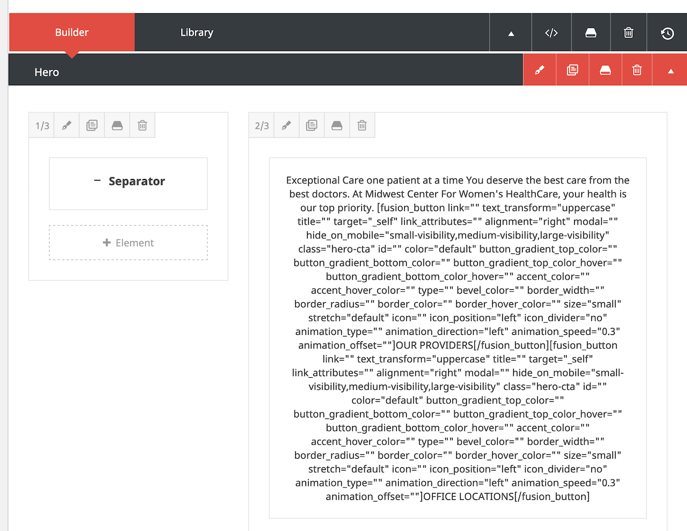

## Overview

### Technique

For the hero image, I created eight art direction versions. I use CSS media queries to display them for standard device breakpoints. I added transition breakpoints to take care of random browser window resizing. All custom CSS is in the page CSS editor.

For the hero text content (heading, subheading, body, and buttons), I created a set of three Fusion Builder elements--one for each screen size. Aadditional CSS was needed to refine positioning, font size, and padding/margins. In the Fusion Builder editor, you'll see the small, medium, and large screen version in that order. Here's an example using the small screen code first.



## HTML

Using Avada Element Visibility

### Small Screen

#### Container Class List

- Parent container: hero-image
- Column container: hero-text-wrapper mobile-text-position

```html
<h1>Exceptional Care</h1>
<p class="hero-text-subheading hero-text-subheading-mob">one patient at a time</p>
<p class="hero-text-body hero-text-body-mob">You deserve the best care from the best doctors. At Midwest Center For Women's HealthCare, your health is our top priority.</p>
[fusion_button link="" text_transform="uppercase" title="" target="_self" link_attributes="" alignment="right" modal="" hide_on_mobile="small-visibility,medium-visibility,large-visibility" class="hero-cta" id="" color="default" button_gradient_top_color="" button_gradient_bottom_color="" button_gradient_top_color_hover="" button_gradient_bottom_color_hover="" accent_color="" accent_hover_color="" type="" bevel_color="" border_width="" border_radius="" border_color="" border_hover_color="" size="small" stretch="default" icon="" icon_position="left" icon_divider="no" animation_type="" animation_direction="left" animation_speed="0.3" animation_offset=""]OUR PROVIDERS[/fusion_button]

[fusion_button link="" text_transform="uppercase" title="" target="_self" link_attributes="" alignment="right" modal="" hide_on_mobile="small-visibility,medium-visibility,large-visibility" class="hero-cta" id="" color="default" button_gradient_top_color="" button_gradient_bottom_color="" button_gradient_top_color_hover="" button_gradient_bottom_color_hover="" accent_color="" accent_hover_color="" type="" bevel_color="" border_width="" border_radius="" border_color="" border_hover_color="" size="small" stretch="default" icon="" icon_position="left" icon_divider="no" animation_type="" animation_direction="left" animation_speed="0.3" animation_offset=""]OFFICE LOCATIONS[/fusion_button]
```

### Medium Screen

#### Container Class List

- Parent container: hero-image
- Column container: hero-text-wrapper tablet-text-position

```html
<h1 id="hero-text-heading-tab">Exceptional Care</h1>
<p class="hero-text-subheading hero-text-subheading-tab">one patient at a time</p>
<p class="hero-text-body hero-text-body-tab">You deserve the best care from the best doctors. At Midwest
Center For Women's HealthCare, your health is our top priority.</p>
[fusion_button link="" text_transform="uppercase" title="" target="_self" link_attributes="" alignment="right" modal="" hide_on_mobile="small-visibility,medium-visibility,large-visibility" class="hero-cta" id="" color="default" button_gradient_top_color="" button_gradient_bottom_color="" button_gradient_top_color_hover="" button_gradient_bottom_color_hover="" accent_color="" accent_hover_color="" type="" bevel_color="" border_width="" border_radius="" border_color="" border_hover_color="" size="large" stretch="default" icon="" icon_position="left" icon_divider="no" animation_type="" animation_direction="left" animation_speed="0.3" animation_offset=""]OUR PROVIDERS[/fusion_button]

[fusion_button link="" text_transform="uppercase" title="" target="_self" link_attributes="" alignment="right" modal="" hide_on_mobile="small-visibility,medium-visibility,large-visibility" class="hero-cta" id="" color="default" button_gradient_top_color="" button_gradient_bottom_color="" button_gradient_top_color_hover="" button_gradient_bottom_color_hover="" accent_color="" accent_hover_color="" type="" bevel_color="" border_width="" border_radius="" border_color="" border_hover_color="" size="large" stretch="default" icon="" icon_position="left" icon_divider="no" animation_type="" animation_direction="left" animation_speed="0.3" animation_offset=""]OFFICE LOCATIONS[/fusion_button]
```

### Large Screen

#### Container Class List

- Parent container: hero-image
- Column container: hero-text-wrapper

```html
<h1>Exceptional Care</h1>
<p class="hero-text-subheading hero-text-subheading-dt">one patient at a time</p>
<p class="hero-text-body hero-text-body-dt">You deserve the best care from the best doctors. At Midwest
Center For Women's HealthCare, your health is our top priority.</p>
[fusion_button link="" text_transform="uppercase" title="" target="_self" link_attributes="" alignment="right" modal="" hide_on_mobile="small-visibility,medium-visibility,large-visibility" class="hero-cta" id="" color="default" button_gradient_top_color="" button_gradient_bottom_color="" button_gradient_top_color_hover="" button_gradient_bottom_color_hover="" accent_color="" accent_hover_color="" type="" bevel_color="" border_width="" border_radius="" border_color="" border_hover_color="" size="" stretch="default" icon="" icon_position="left" icon_divider="no" animation_type="" animation_direction="left" animation_speed="0.3" animation_offset=""]OUR PROVIDERS[/fusion_button]

[fusion_button link="" text_transform="uppercase" title="" target="_self" link_attributes="" alignment="right" modal="" hide_on_mobile="small-visibility,medium-visibility,large-visibility" class="hero-cta" id="" color="default" button_gradient_top_color="" button_gradient_bottom_color="" button_gradient_top_color_hover="" button_gradient_bottom_color_hover="" accent_color="" accent_hover_color="" type="" bevel_color="" border_width="" border_radius="" border_color="" border_hover_color="" size="" stretch="default" icon="" icon_position="left" icon_divider="no" animation_type="" animation_direction="left" animation_speed="0.3" animation_offset=""]OFFICE LOCATIONS[/fusion_button]
```

---

## CSS

```css
/* Variables */

:root {
  --hero-height-lg: 400px; /* Was 577px. */
}

/* Hero Text and CTAs */

.hero-text-wrapper {
  text-align: right;
}

/* Refactor: Make this the default. */
.mobile-text-position {
  position: absolute;
  right: -10px;
  top: 400%;
}

.tablet-text-position {
  position: absolute !important;
  right: -45px;
  top: 300%;
}

#hero-text-content h1,
#hero-text-content h2,
#hero-text-content p {
  color: white;
}

#hero-text-heading-tab {
  font-size: 3em !important; /* Refactor */
}

#hero-text-content h1 {
  font-size: 4.5em;
  margin-top: 0;
  margin-bottom: 0;
}

.hero-text-subheading {
  font-family: 'Open Sans Light';
  opacity: 0.9;
}

.hero-text-subheading-mob {
  font-size: 1.7em;
  line-height: 1;
}

.hero-text-subheading-tab {
  font-size: 2.35em;
  line-height: 1;
}

.hero-text-subheading-dt {
  font-size: 3.45em;
  line-height: 1;
}

.hero-text-body {
  font-family: 'Open Sans Light';
  opacity: 0.8;
}

.hero-text-body-mob {
  font-size: 0.85em;
  padding: 0.2em 0;
  line-height: 1.2;
}

.hero-text-body-tab {
  font-size: 0.95em;
  padding: 0.75em 0;
  margin-bottom: -0.2em !important;
}

.hero-text-body-dt {
  font-size: 1.3em;
  padding: 0.75em 0;
  margin-bottom: -0.5em !important;
}

/* Media Query for Text and CTAs */

@media only screen and (min-width: 1024) and (max-width: 1300px) {
  #hero-text-content h1 {
    font-size: 3em;
  }
  .hero-text-subheading-dt {
    font-size: 2.35em;
    line-height: 1;
  }
  .hero-text-body-dt {
    font-size: 0.95em;
    padding: 0.75em 0;
    margin-bottom: -0.2em !important;
  }
}

/* Hero Image */

/* Mobile First */
.hero-image {
  background: linear-gradient(rgba(0, 0, 0, 0.3), rgba(0, 0, 0, 0.3)),
    url("http://mwcwh.flywheelsites.com/wp-content/uploads/2020/02/smiling-woman-hat-bicycle-mob-480w.jpg");
  background-repeat: no-repeat;
  background-position: center;
  background-size: cover;
  height: 400px;
}

/* Media Queries for Hero Image */

/* Mobile Landscape 1 */
@media only screen and (max-width: 767.998px) and (orientation: landscape) {
  .hero-image {
    background: center / cover no-repeat
        linear-gradient(rgba(0, 0, 0, 0.3), rgba(0, 0, 0, 0.3)),
      url("http://mwcwh.flywheelsites.com/wp-content/uploads/2020/02/smiling-woman-hat-bicycle-mob-land-720w.jpg");
    height: 405px;
  }
}

/* Mobile landscape 2 */
@media only screen and (min-width: 720.998px) and (max-width: 812px) and (orientation: landscape) {
  .hero-image {
    background: center / cover no-repeat
        linear-gradient(rgba(0, 0, 0, 0.3), rgba(0, 0, 0, 0.3)),
      url("http://mwcwh.flywheelsites.com/wp-content/uploads/2020/02/smiling-woman-hat-bicycle-mob-land-812w.jpg");
      height: 375px;
  }
}

/* Tablet Portrait Breakpoint */
@media only screen and (min-width: 480.998px) and (max-width: 768px) and (orientation: portrait) {
  .hero-image {
    background: center / cover no-repeat
        linear-gradient(rgba(0, 0, 0, 0.3), rgba(0, 0, 0, 0.3)),
      url("http://mwcwh.flywheelsites.com/wp-content/uploads/2020/02/smiling-woman-hat-bicycle-tab-port-768w.jpg");
    height: 576px;
  }
}

/* Intermediate portrait breakpoint 1. */
@media only screen and (min-width: 460px) and (max-width: 627px) {
  .hero-image {
    background: center / cover no-repeat
        linear-gradient(rgba(0, 0, 0, 0.3), rgba(0, 0, 0, 0.3)),
      url("http://mwcwh.flywheelsites.com/wp-content/uploads/2020/02/smiling-woman-hat-bicycle-mob-land-720w.jpg");
      height: 405px;
  }
}

/* Intermediate Portrait Breakpoint 2 */
@media only screen and (min-width: 812.998px) and (max-width: 1023.998px) {
  .hero-image {
    background: center / cover no-repeat
        linear-gradient(rgba(0, 0, 0, 0.3), rgba(0, 0, 0, 0.3)),
      url("http://mwcwh.flywheelsites.com/wp-content/uploads/2020/02/smiling-woman-hat-bicycle-lt1-1240w-2.jpg");
      height: var(--hero-height-lg);
  }
}

/* Tablet Landscape & Laptop Breakpoint 1 */
@media only screen and (min-width: 1024px) {
  .hero-image {
    background: linear-gradient(rgba(0, 0, 0, 0.3), rgba(0, 0, 0, 0.3)),
      url("http://mwcwh.flywheelsites.com/wp-content/uploads/2020/02/smiling-woman-hat-bicycle-lt1-1240w-2.jpg");
    height: var(--hero-height-lg);
  }
}

/* Laptop 2 */
@media only screen and (min-width: 1280px) {
  .hero-image {
    background: linear-gradient(rgba(0, 0, 0, 0.3), rgba(0, 0, 0, 0.3)),
      url("http://mwcwh.flywheelsites.com/wp-content/uploads/2020/02/smiling-woman-hat-bicycle-lt2-1440w-2.jpg");
    height: var(--hero-height-lg);
  }
}

/* Desktop */
@media only screen and (min-width: 1440.998px) {
  .hero-image {
    background: linear-gradient(rgba(0, 0, 0, 0.3), rgba(0, 0, 0, 0.3)),
      url("http://mwcwh.flywheelsites.com/wp-content/uploads/2020/02/smiling-woman-hat-bicycle-dt-2200w-2.jpg");
    height: var(--hero-height-lg);
  }
}
```